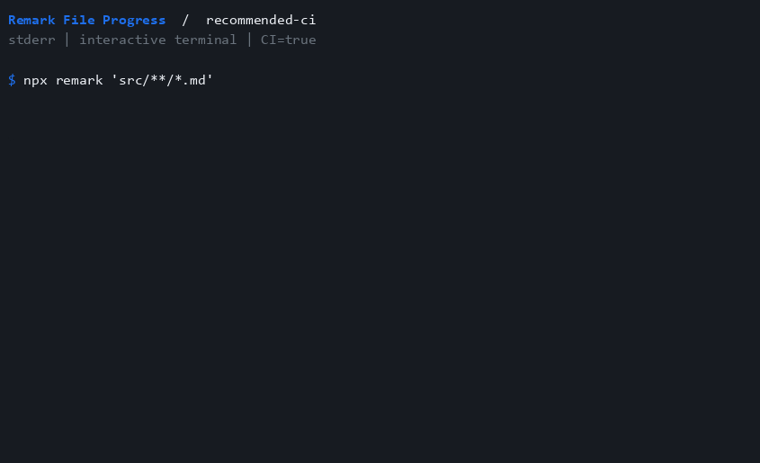

# recommended-ci

<span className="rfp-pill rfp-tone-blue">Quiet in CI</span>

Hide all plugin output when CI is exactly true.

## Configuration

```js
import preset from "remark-lint-file-progress/configs/recommended-ci";

export default preset;
```

Keep your existing shared configs before this preset.

## Terminal preview



This recording uses CI=true. Outside CI, the preset displays ordinary progress.

## Make it yours

See [all options](../activate.md), [compare presets](../presets.md), and [compatibility](../compatibility.md) for summary and terminal behavior. Explore the [demo gallery](../demos.md#recommended-ci) or follow the [setup guide](../getting-started.md).
