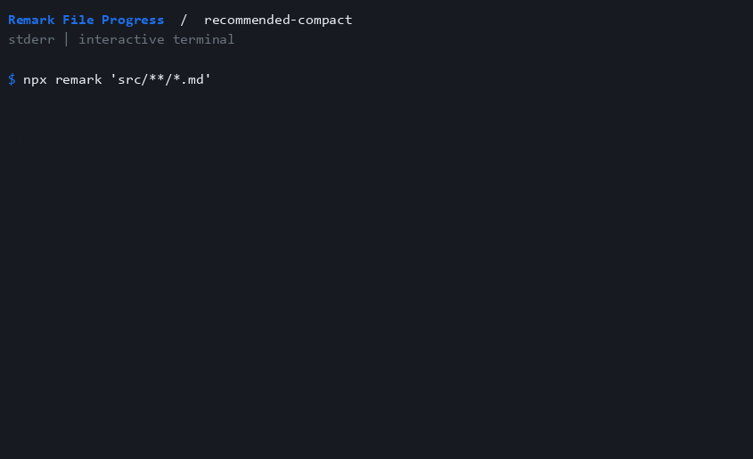

# recommended-compact

Show generic activity without filenames; redirected output announces it once.

```js
import preset from "remark-lint-file-progress/configs/recommended-compact";

export default preset;
```



See [all options](../activate.md) and [compatibility](../compatibility.md) for summary and terminal behavior.
