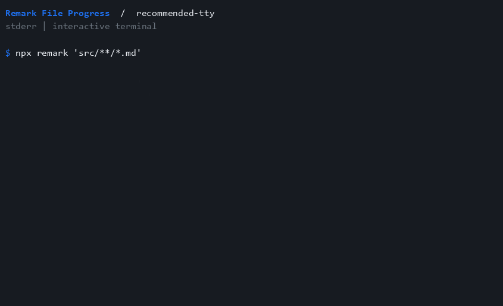

# recommended-tty

Show output only when stderr is an interactive terminal.

```js
import preset from "remark-lint-file-progress/configs/recommended-tty";

export default preset;
```



See [all options](../activate.md) and [compatibility](../compatibility.md) for summary and terminal behavior.
